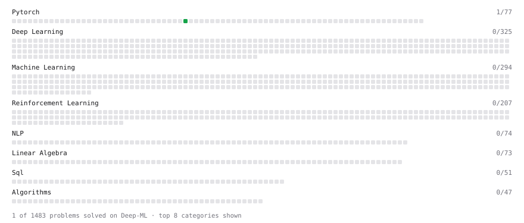

# Deep-ML

My machine learning practice from [Deep-ML](https://www.deep-ml.com). Every solution here was written by hand.

**2** solved · 2 problems · 0 labs · 0 math

[**Browse the interactive portfolio**](https://devpatelio.github.io/deep-ml/) to replay this filling in over time.

## Problems

| | Difficulty | Solved | |
| --- | --- | --- | --- |
| [Create and Inspect a Tensor](https://www.deep-ml.com/problems/1220) | easy | 2026-10-01 | [solution](problems/1220-create-and-inspect-a-tensor) |
| [LoRA: Low-Rank Adaptation Forward Pass](https://www.deep-ml.com/problems/222) | medium | 2026-10-05 | [solution](problems/0222-lora-low-rank-adaptation-forward-pass) |

---

_This file is regenerated by Deep-ML on every push._
